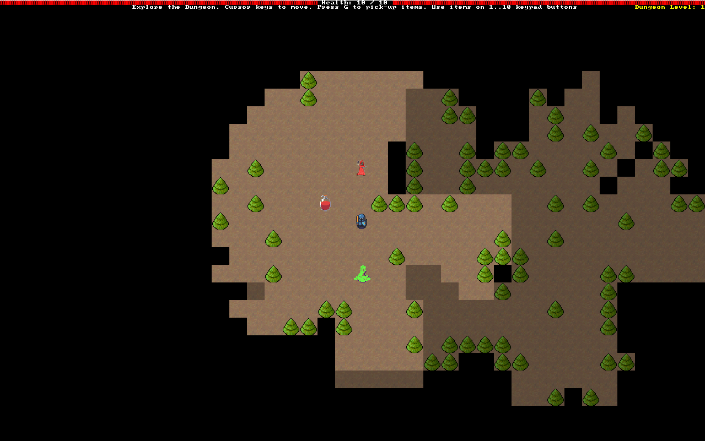
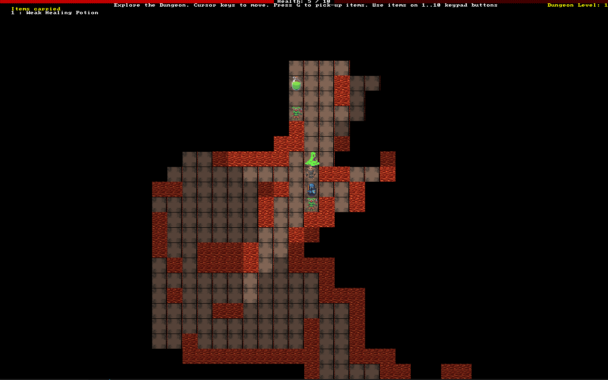
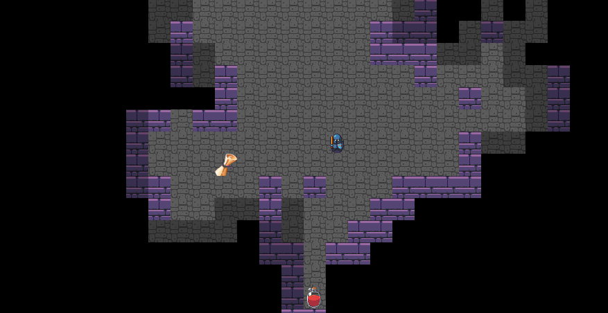
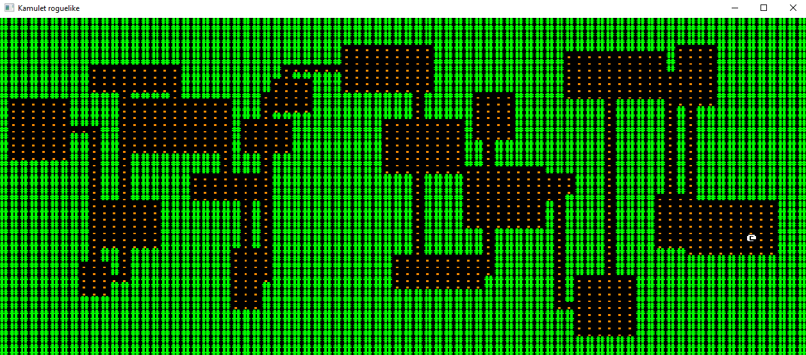
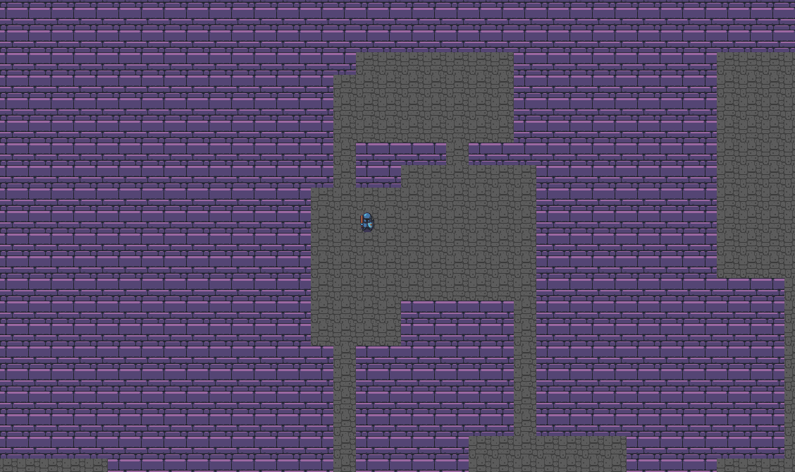

# Kamulet Roguelike

## Download release and launch exe file to play ->

<h4>Technologies:
 
 
<ul>
<li>Rust language
<li>Bracket-lib - https://github.com/amethyst/bracket-lib
<li>Legion (ECS) - https://github.com/amethyst/legion
<li>Serde
<li>RON - Rusty object notation
<li>Soloud - CMake problem...
</ul>

 

 

<u><b><h3>Project Name - Kamulet Roguelike</h3></b></u> 

<u><b><h3>Short Description:</h3></b></u>  
A dungeon crawler with 5 procedurally generated levels, 13 monsters of increasing difficulty, many additional items
and turn-based movement.

<u><b><h3>Story:</h3></b></u>  

Another knight is try to take a Kamulet - great relic that can defence all villages against monsters, can he go through five levels and find Kamulet or he die like others...

<u><b><h3>Basic Game Loops:</h3></b></u>  
<ol>
<li>Enter dungeon level.
<li>Explore, revealing the map.
<li>Encounter enemies whom the player fights or flees from.
<li>Find power-ups and use them to strengthen the player.
<li>Locate the exit to the level - go to 1.
</ol>

<u><b><h3>TODO:</h3></b></u>  
<ul>
<li><strike>Create a basic dungeon map</strike>
<li><strike>Place the player and let them walk around</strike>
<li><strike>Spawn monsters, draw them, and let the player kill them by walking into them.</strike>
<li><strike>Add health and a combat system that uses it.</strike>
<li><strike>Add healing potions.</strike>
<li><strike>Display a “game over” screen when the player dies.</strike>
<li><strike>Add the Kamulet to the last level and let the player win by reaching it</strike>
<li><strike>Add FOV</strike>
<li><strike>Add more interesting dungeon designs.</strike>
<li><strike>Add some dungeon themes.</strike>
<li><strike>Add multiple layers to the dungeon, with the Amulet on the last one.</strike>
<li><strike>Add varied weapons to the game.</strike>
<li><strike>Move to a data-driven design for spawning enemies.</strike>
<li>Consider some visual effects to make combat more visceral.
<li>Consider keeping score.
<li>Consider Music
<li><strike>Kamulet name</strike>

</ul>

</h3>

Arts: (With some additionals by myself)
<ul>
<li>https://opengameart.org/content/unfinished-dungeon-tileset
<li>https://opengameart.org/content/fantasy-magic-set
<li>https://opengameart.org/content/fantasy-sword-set
</ul>
Thanks that book for learn and help! - https://www.goodreads.com/book/show/55961302-hands-on-rust
<h3>Logs:</h3>

