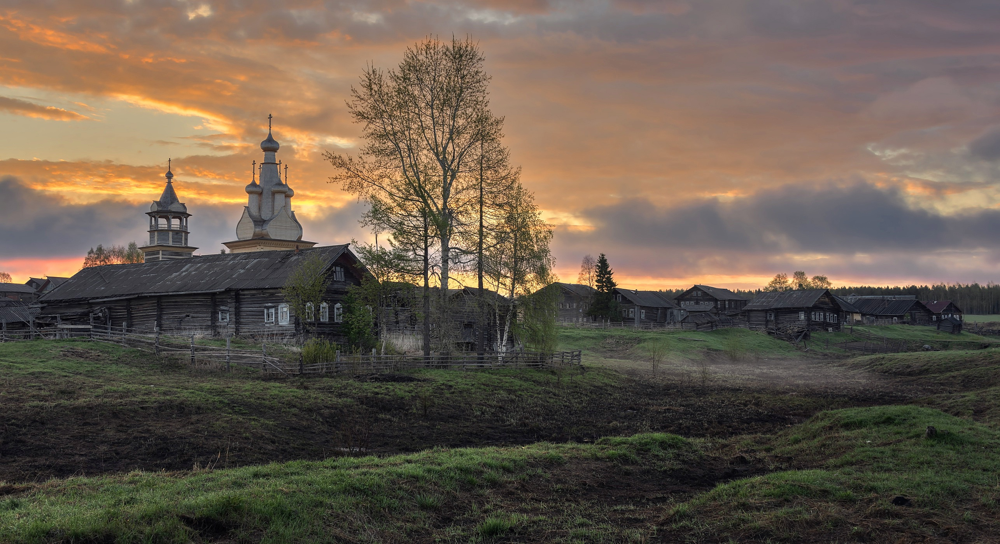
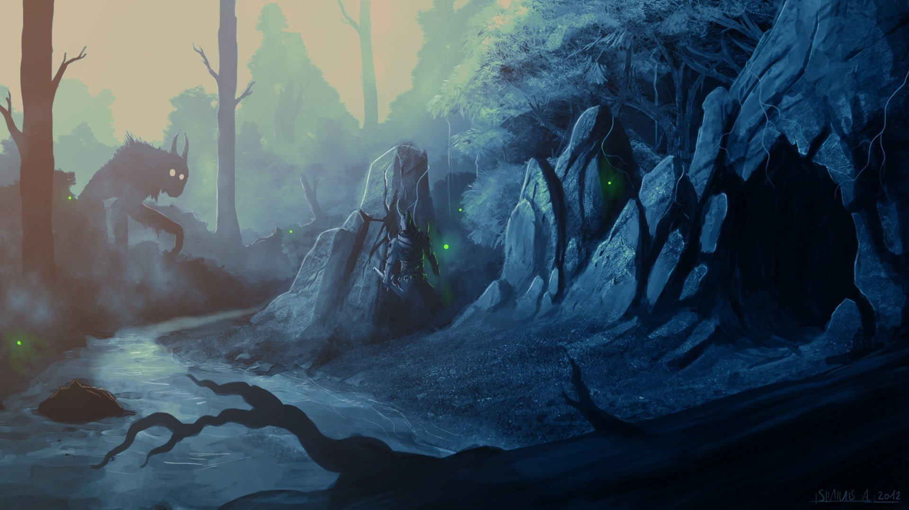

# Kamulet Roguelike

<h4>Technologies:
 
 
<ul>
<li>Rust language
<li>Bracket-lib - https://github.com/amethyst/bracket-lib
<li>Legion (ECS) - https://github.com/amethyst/legion
</ul>

 

 

<u><b><h3>Project Name:</h3></b></u>  Kamulet Roguelike

<u><b><h3>Short Description:</h3></b></u>  
A dungeon crawler with procedurally generated levels, monsters of increasing difficulty,
and turn-based movement.

<u><b><h3>Story:</h3></b></u>  

A few years ago in the our hero village - "Anzo" was open some cave, non inhabited by humans, in the next night from the wells and caves around come some abominations. At first they just scary villagers and don't give them go outside house at night, but last months monster start to hurt people and even killed one boy
 
The elder one gather expedition to attack the caves under the village but it's was lost with many strong men, one of them was father of our hero
 
Monsters become even more aggresive and now they just enter village whenever they want. The only hope it's go inside the caves and find what corrupted relic doing this dark stuff.
 
One night when all people sleep in church (coz now monsters going inside houses) our hero with heart of steel and sad for father with biggest nightmares, wakeup and stealthy go outside, climbed down the church well with hope to find father, what he really found there you will know from the game...
 

<u><b><h3>Basic Game Loops:</h3></b></u>  
<ol>
<li>Enter dungeon level.
<li>Explore, revealing the map.
<li>Encounter enemies whom the player fights or flees from.
<li>Find power-ups and use them to strengthen the player.
<li>Locate the exit to the level - go to 1.
</ol>

<u><b><h3>TODO:</h3></b></u>  
<ul>
<li><strike>Create a basic dungeon map</strike>
<li><strike>Place the player and let them walk around</strike>
<li><strike>Spawn monsters, draw them, and let the player kill them by walking into them.</strike>
<li><strike>Add health and a combat system that uses it.</strike>
<li>Add healing potions.
<li><strike>Display a “game over” screen when the player dies.</strike>
<li>Add the Amulet of Yala to the level and let the player win by reaching it
<li>Add Fields-of-View.
<li>Add more interesting dungeon designs.
<li>Add some dungeon themes.
<li>Add multiple layers to the dungeon, with the Amulet on the last one.
<li>Add varied weapons to the game.
<li>Move to a data-driven design for spawning enemies.
<li>Consider some visual effects to make combat more visceral.
<li>Consider keeping score.
<li>Kamulet 

</ul>

</h3>

Arts: (With some additionals by myself)
<ul>
<li>https://opengameart.org/content/unfinished-dungeon-tileset
<li>https://opengameart.org/content/fantasy-magic-set
<li>https://opengameart.org/content/fantasy-sword-set
</ul>

Thanks that book for learn and help! - https://www.goodreads.com/book/show/55961302-hands-on-rust